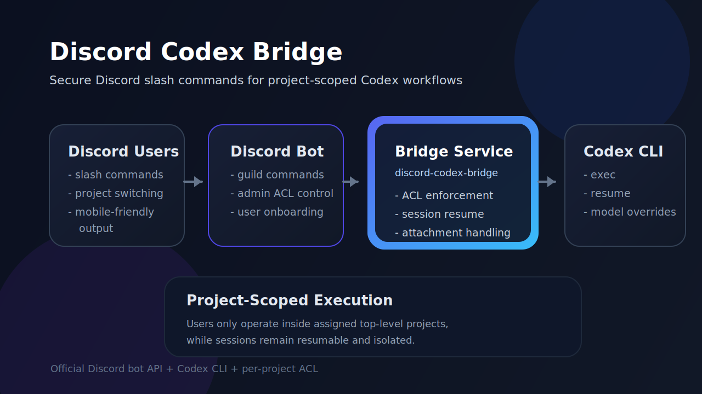

# Discord Codex Bridge

<p align="center">
  <strong>A production-ready Discord slash-command bridge for Codex CLI</strong><br />
  Run Codex from a private Discord server with project-scoped access control, resumable sessions, mobile-friendly output, and admin-managed user permissions.
</p>

<p align="center">
  <a href="https://github.com/HarryTBB/discord-codex-bridge/blob/main/LICENSE">
    
  </a>
  
  
  
</p>

<p align="center">
  
</p>

## Overview

**Discord Codex Bridge** connects a Discord bot to a local Codex CLI runtime using official Discord slash commands.

It is designed for operators who want a secure, practical way to:

- interact with Codex from Discord without exposing a local terminal
- restrict users to specific top-level projects
- resume existing Codex sessions by project
- manage user permissions from Discord itself
- keep responses readable on mobile devices

This project uses the **official Discord bot API**. It does **not** automate personal Discord accounts or rely on self-bot behavior.

## Highlights

- **Project-scoped execution** so users can only work inside explicitly assigned projects
- **Slash-command workflow** with no `MESSAGE_CONTENT` intent requirement
- **Per-user overrides** for model, reasoning effort, and execution permission
- **Session resume** for the latest Codex session in the active project
- **Attachment support** for images, text, and code files
- **Mobile-friendly UI** with structured status panels and progressive `/ask` updates
- **Admin commands** for onboarding users and granting project access
- **Optional auto-onboarding** for new guild members with default project access

## Architecture

For predictable GitHub rendering, the architecture overview is shown in the static diagram above.

Runtime flow:

```text
Discord User -> Discord Bot -> discord-codex-bridge -> Codex CLI -> Project Workspace
                                                           └──────> Shared CODEX_HOME (optional)
```

## Core Capabilities

### Project isolation

When `DISCORD_USER_PROJECTS` is configured, the bridge treats it as the **single source of truth** for access control.

That means:

- users only see projects assigned to them
- `/project` and `/project-switch` only work for assigned projects
- `/cd`, `/ls`, `/mkdir`, and `/ask` are restricted to the current project root
- `codex exec` runs with `-C <current-project-root>`, so write access stays inside the active project

### Session continuity

Each Discord scope keeps its own:

- current working directory
- active Codex thread ID

Scope model:

- **Direct Messages**: one scope per user
- **Guild channels**: one scope per `guild + channel + user`

If `CODEX_HOME` points to the same Codex home used by another Codex environment, the bridge can resume those sessions as well.

### Mobile-first responses

The bridge formats output for Discord mobile clients:

- status and filesystem commands use readable code panels
- `/ask` updates the user with a live progress card
- long responses are split into safe chunks automatically

## Requirements

- **Node.js 20+**
- **Codex CLI** installed and already authenticated
- **Discord application** with a bot token
- **Discord guild (server)** for command registration
- **Linux or WSL** recommended for long-running deployment

## Quick Start

```bash
git clone https://github.com/HarryTBB/discord-codex-bridge.git
cd discord-codex-bridge
npm install
cp .env.example .env
```

Update `.env`, then register commands and start the bridge:

```bash
npm run register
npm start
```

## Release Notes

The first public release summary is available at:

- [docs/release-notes/v0.1.0.md](./docs/release-notes/v0.1.0.md)

## Installation

### 1. Clone the repository

```bash
git clone https://github.com/HarryTBB/discord-codex-bridge.git
cd discord-codex-bridge
```

### 2. Install dependencies

```bash
npm install
```

### 3. Create the environment file

```bash
cp .env.example .env
```

### 4. Configure your Discord bot

At minimum, configure:

- `DISCORD_BOT_TOKEN`
- `DISCORD_APPLICATION_ID`
- `DISCORD_GUILD_ID`
- `DISCORD_ADMIN_USER_IDS`
- `DISCORD_USER_PROJECTS`

### 5. Register slash commands

```bash
npm run register
```

### 6. Start the service

```bash
npm start
```

## Configuration

### Required variables

| Variable | Description |
| --- | --- |
| `DISCORD_BOT_TOKEN` | Discord bot token |
| `DISCORD_APPLICATION_ID` | Discord application ID |
| `DISCORD_GUILD_ID` | Guild ID used for slash-command registration |
| `DISCORD_ADMIN_USER_IDS` | Discord user IDs allowed to run admin commands |
| `DISCORD_USER_PROJECTS` | User-to-project access map |
| `WORKSPACE_ROOT` | Top-level workspace root visible to Codex |
| `DEFAULT_CWD` | Initial working directory used for new scopes |

### Optional variables

| Variable | Description |
| --- | --- |
| `DISCORD_ALLOWED_USER_IDS` | Legacy allowlist mode when `DISCORD_USER_PROJECTS` is empty |
| `DISCORD_USER_PERMISSIONS` | Per-user permission override (`default` or `full-access`) |
| `DISCORD_USER_MODELS` | Per-user model override |
| `DISCORD_USER_REASONING` | Per-user reasoning override |
| `DISCORD_AUTO_ADD_ON_GUILD_JOIN` | Enable automatic onboarding for new guild members |
| `DISCORD_AUTO_ADD_PROJECTS` | Default project list granted during automatic onboarding |
| `DISCORD_AUTO_ADD_PERMISSION` | Default permission assigned during automatic onboarding |
| `STATE_DIR` | Local state directory |
| `CODEX_HOME` | Shared Codex home directory |
| `CODEX_MODEL` | Global default model |
| `CODEX_EXEC_MODE` | Global execution mode: `read-only`, `workspace-write`, or `danger-full-access` |
| `CODEX_TIMEOUT_MS` | Timeout for Codex executions |
| `CODEX_MESSAGE_PREFIX` | Prefix prepended to each prompt |
| `DISCORD_MAX_ATTACHMENT_BYTES` | Maximum size per attachment |

### Example `.env`

```env
DISCORD_BOT_TOKEN=replace-me
DISCORD_APPLICATION_ID=replace-me
DISCORD_GUILD_ID=replace-me
DISCORD_ADMIN_USER_IDS=123456789012345678

DISCORD_USER_PROJECTS=123456789012345678:playground|backend-api;987654321098765432:playground
DISCORD_USER_PERMISSIONS=123456789012345678:full-access
DISCORD_USER_MODELS=123456789012345678:gpt-5.4-mini
DISCORD_USER_REASONING=123456789012345678:high

DISCORD_AUTO_ADD_ON_GUILD_JOIN=false
DISCORD_AUTO_ADD_PROJECTS=playground
DISCORD_AUTO_ADD_PERMISSION=default

WORKSPACE_ROOT=/path/to/workspace
DEFAULT_CWD=/path/to/workspace
STATE_DIR=./data
CODEX_HOME=/path/to/.codex

CODEX_EXEC_MODE=workspace-write
CODEX_TIMEOUT_MS=900000
DISCORD_MAX_ATTACHMENT_BYTES=20971520
```

## Access Control Model

### User-to-project mapping

`DISCORD_USER_PROJECTS` accepts a semicolon-separated list of users, where each user can access one or more top-level projects:

```env
DISCORD_USER_PROJECTS=123456789012345678:playground|backend-api;987654321098765432:frontend-app
```

### Admin operations

Admins can manage access from Discord using slash commands and either:

- mention the user directly with `@user`
- provide a fallback numeric `user_id`

### Permission levels

| Permission | Behavior |
| --- | --- |
| `default` | Uses the global `CODEX_EXEC_MODE` |
| `full-access` | Uses `danger-full-access` for that specific user |

## Commands

### User commands

| Command | Description |
| --- | --- |
| `/help` | Show available commands |
| `/status` | Show current project, directory, permission mode, model, reasoning, and active session |
| `/ls [path]` | List files like `ls -la` inside the current project |
| `/ask <prompt> [attachment1..3]` | Send a task to Codex in the current project |
| `/resume` | Resume the latest Codex session for the current project |
| `/projects` | List the projects assigned to the current Discord user |
| `/project <name>` | Create an assigned top-level project and switch into it |
| `/project-switch <name>` | Switch to an assigned existing project |
| `/mkdir <path>` | Create a directory inside the current project |
| `/cd <path>` | Change directory inside the current project |
| `/pwd` | Show the current directory |
| `/reset` | Reset the current scope and return to the project root |
| `/model [value]` | Show or override the Codex model for the current user |
| `/reasoning [value]` | Show or override reasoning effort for the current user |
| `/rate-limits` | Show the latest available Codex rate-limit estimate |

### Admin commands

| Command | Description |
| --- | --- |
| `/admin-user-add` | Add a user to the ACL and provision default access |
| `/admin-user-remove` | Remove a user from the ACL and clear saved scope state |
| `/admin-user-grant-project` | Grant one project to a user |
| `/admin-user-set-permission` | Set `default` or `full-access` for a user |

## Attachments

`/ask` supports up to **three** Discord attachments.

Behavior:

- **images** are downloaded and passed to Codex using `--image`
- **text and code files** are downloaded and referenced in the prompt
- **other files** are saved to disk and exposed by path for tooling-based workflows

Uploaded files are stored under:

```text
<project-root>/.discord-uploads/<discord-user-id>/
```

## Session Resume

`/resume` binds the current Discord scope to the **most recent Codex session inside the active project** and shows a preview of recent conversation history.

This works especially well when `CODEX_HOME` points to a shared Codex home directory.

## systemd Deployment

An example service file is included at:

```text
deploy/discord-codex-bridge.service
```

Install it like this:

```bash
sudo cp deploy/discord-codex-bridge.service /etc/systemd/system/discord-codex-bridge.service
sudo systemctl daemon-reload
sudo systemctl enable --now discord-codex-bridge
sudo systemctl status discord-codex-bridge
```

Before enabling the service, update the sample unit so:

- `User=` matches your Linux user
- `WorkingDirectory=` matches your installation path
- `EnvironmentFile=` points to your real `.env`

## Discord Bot Setup Notes

This bridge uses **guild slash commands**, which are ideal for private servers because updates propagate quickly.

If you want to enable automatic onboarding on guild join, also enable the **Server Members Intent** in the Discord Developer Portal and set:

```env
DISCORD_AUTO_ADD_ON_GUILD_JOIN=true
```

## Development

### Validate syntax

```bash
npm run check
```

### Register commands after changing command definitions

```bash
npm run register
```

## Security Notes

- Do **not** commit `.env`, state files, or Codex session data
- Keep your Discord bot token private
- Prefer `DISCORD_USER_PROJECTS` over broad allowlists
- Use `full-access` sparingly
- Store the bridge in a private server or restricted admin workflow unless you fully trust every assigned user

## Troubleshooting

### Commands do not appear in Discord

- confirm `DISCORD_APPLICATION_ID` and `DISCORD_GUILD_ID`
- re-run `npm run register`
- verify the bot is in the correct server

### User can see the bot but cannot use project commands

- confirm the user exists in `DISCORD_USER_PROJECTS`
- confirm the assigned project name matches a top-level project key

### Auto-onboarding does not trigger

- enable `DISCORD_AUTO_ADD_ON_GUILD_JOIN=true`
- enable **Server Members Intent** in the Discord Developer Portal
- restart the service after changing the configuration

### `/resume` does not find a session

- verify `CODEX_HOME` points to the correct Codex home directory
- make sure a prior Codex session exists inside the active project

## License

Released under the **MIT License**. See [LICENSE](./LICENSE).
